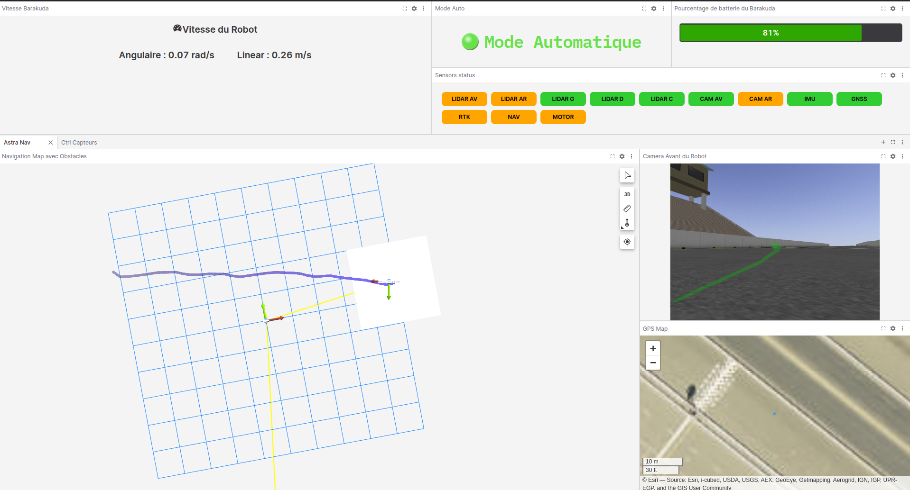
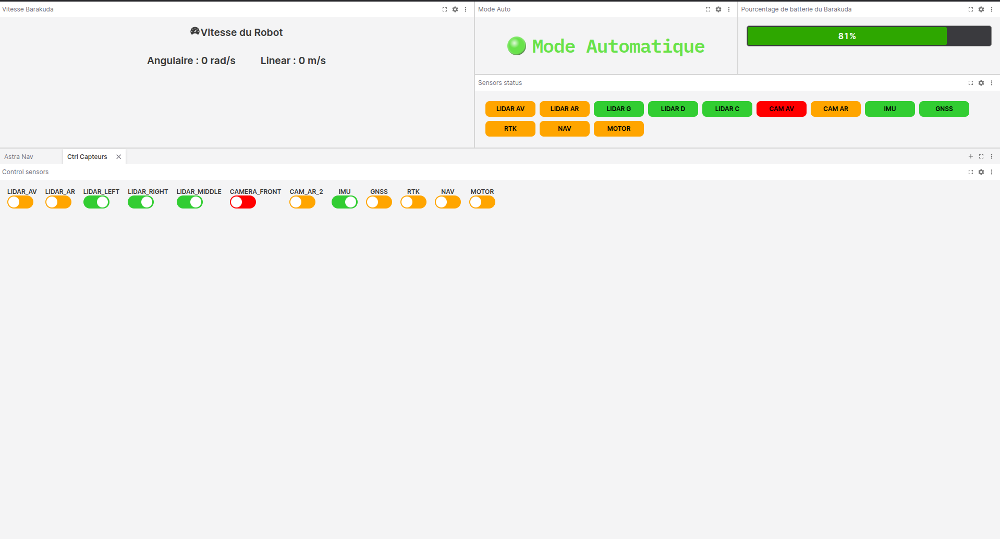

# Astra Foxglove Interface

## 🧾 Description

Cette interface graphique est basée sur la solution **Foxglove**, qui bien que non open-source, permet le développement de **plugins personnalisés** pour des cas d'usage spécifiques, sans restrictions.

Les layouts et panneaux développés dans ce projet ont été créés spécifiquement pour le projet **@Astra**.

---

## 🚧 Statut

Travail en cours — certains paramètres sont encore **codés en dur**.

---

## 🌳 Arborescence du projet

```bash
docs/
└── Documentation et images de tests

Layouts/
└── Layout spécifique au projet Astra (frontend et appels aux différents panneaux)

ros2_backend/
├── Workspace ROS 2
├── Packages utilisés pour interagir avec les différents drivers/briques sur le Barakuda
│
├── barakuda_sensors_ctrl_msgs/
│   └── Définit un message de service pour contrôler les capteurs :
│
│       Service : /sensor/set_sensor_state
│       Request :
│           string sensor_name
│           bool state
│       Response :
│           bool success
│
│       Exemples :
│         - sensor_name : lidar_middle, lidar_left, lidar_right, camera_front, camera_rear, gps, imu
│         - state : true → allumé / false → éteint
│
├── barakuda_sensors_ctrl/
│   └── Implémente le service :
│       1. Initialise l’état de chaque capteur à "allumé"
│       2. Écoute les requêtes de service `/sensor/set_sensor_state` pour activer/désactiver les capteurs
│       3. Publie l’état des capteurs sur `/sensor/<capteur>/state` (topic latched)
│
│       💡 À faire :
│       Ajouter tous les capteurs utilisés (ex: lidar avant/arrière ?) dans le code.
│
├── barakuda_path_image_annotator/
│   └── Projette le chemin global du robot sur l’image de la caméra.
│       Entrées :
│         - `nav_msgs/Path`
│         - `sensor_msgs/Image` (rectifiée de préférence)
│         - `sensor_msgs/CameraInfo`
│       Sortie :
│         - `foxglove_msgs/Annotations` (superposition pour panneau image de Foxglove)
```

## ⚙️ Installation

1. Installation des packages ROS dans ros2_backend

```bash
cd ros2_backend
colcon build --symlink-install
```

2. Installation des panneaux personnalisés (sur le PC de contrôle)

   a. Installer Node.js 16.04

```bash
cd scripts
./install-node-js.sh
```

b. Installer les dépendances globales de pannaux

```bash
cd scripts
./install-deps.sh
```

c. Builder les panneaux personnalisés

```bash
cd scripts
./build.sh
```

## 🚀 Lancement

### 📡 Sur le robot _Barakuda_

Lancer le backend ROS 2 :

```bash
cd ros2_backend
ros2 launch barakuda_ihm_backend barakuda_ihm_backend.launch.py
```

ça lance foxglove_bridge et le backend de service

### 🖥️ Sur le PC de contrôle

1. Lancer Foxglove Studio
2. En haut à droite, cliquer sur LAYOUT → Import from file
3. Sélectionner le fichier : ASTRA_GUI

### 🖼️ Première vue

1. **Vue principale utilisée par le jury**, mais également utilisée pour commander le robot ( à l'instant ):  
   

2. **Vue de contrôle des capteurs séparés**, conçue pour ne pas encombrer l'interface principale :  
   

- Vert : aucune problème
- Rouge : Coupé ou infonctionnel
- orange : inconnu

## 📌 Remarques

- Tous les topics /sensor/<capteur>/state sont latched, donc leur dernière valeur est toujours disponible ( capteur allumé ou pas (true ou false )).
- Ce projet est spécifique à l’environnement du robot Barakuda et au projet Astra.

## ✅ TODO

- [ ] Rajout de tous les capteurs utilisés (Lidar avant, arrière ? à confirmer)
- [ ] Rajout de panneaux pour la gestion de trajectoires et l’upload de scénarios
- [ ] Rajout de boutons **Safety First**
- [ ] Rajout d’un indicateur de **position du point de départ** (UTM31)
- [ ] Rajout d’un indicateur de **position objectif** (UTM31)
- [ ] Rajout d’un indicateur de **position absolue du robot** (UTM31)
- [ ] Rajout de l’état des fonctions **rejeu** et **retour sur trace**
- [ ] Rajout de l’état du suivi **bas-côté**
- [ ] Rajout de l’état du **mode de pilotage du robot**
